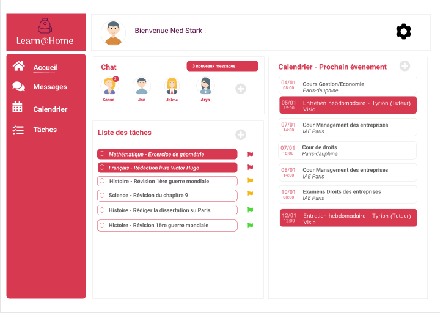
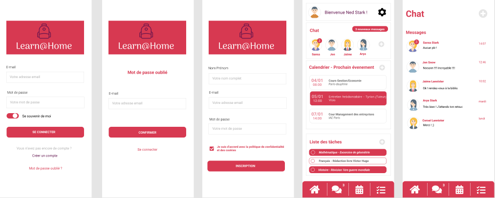

# Learn-Home
Figma - Définir les besoins pour une app de soutien scolaire
- [link](https://www.figma.com/file/mC2UtvrscpNWrkOez7tqg1/LEARN%40HOME?node-id=0%3A1)

# Présentation du projet 
 
Learn@Home est une association qui met en relation des enfants en difficulté                       
scolaire et des bénévoles, en ligne. Ils ont pour objectif de permettre à tout élève,                             
où qu’il soit, d’accéder à un soutien scolaire à distance. 
Chaque élève inscrit sur le site a un tuteur bénévole, qui lui est assigné. Le                             
bénévole a pour objectif de soutenir l’élève dans son apprentissage, à travers de                         
courts rendez-vous prévus chaque semaine. Durant ces rendez-vous, le bénévole                   
aide l’élève à réaliser ses devoirs et à s’organiser. 
Pour faciliter les interactions et la communication, Learn@Home souhaite créer                   
un nouveau site web, qui doit être composé des pages suivantes : 

# 1. La page de connexion 
La page de connexion doit permettre à un élève ou à un bénévole de se 
connecter. Toutes les autres pages ne sont accessibles qu’une fois connecté à un 
compte. Cette page doit intégrer :  
- Un système de récupération de mot de passe oublié 
- Un lien vers une page de création de compte 
 
# 2. Le tableau de bord 
 
Cette page servira de page principale et devra donc regrouper un récapitulatif de 
toutes les informations récentes et importantes en provenance des autres pages : 
chat, calendrier, gestion des tâches.  
 
La page affichera : 
- Un récapitulatif des tâches (to-do list) issu de la page de gestion des tâches 
(5.) 
- la liste des événements prochains, issue de la page calendrier (4.) 
- Un compteur de messages non lus. 
 
# 3. L’interface de chat 
 
L’interface de chat de Learn@Home est à une page de chat classique, intégrant 
un système de discussion instantané entre élèves et bénévoles. Elle doit aussi 
permettre d’accéder à l’historique des conversations, et d’ajouter ou supprimer 
un contact. 
 
# 4. La page de calendrier 
La page de calendrier de Learn@Home correspond à une page de calendrier 
classique, sur laquelle s’affichent les différents événements, rendez-vous de 
l’utilisateur. 
 
# 5. La page de gestion des tâches 
 
L’interface de cette page doit permettre de créer des tâches pour soi-même ou 
pour un autre utilisateur.  
● L’élève ne peut créer des tâches que pour lui-même. 
● Le bénévole peut créer des tâches pour les élèves qu’il suit. 
